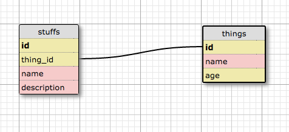

# App Name here

## User Stories

- As a visitor, I want to...
- As a user, I want to...
- As an admin, I want to...

## Schema screenshot

-

## Installation Notes

- Ruby 2.2.4
- Rails 4.2.6
- (List other development dependencies here).

## Deployment details and link

- [App Name Link](https:yourthing.herokuapp.com)
